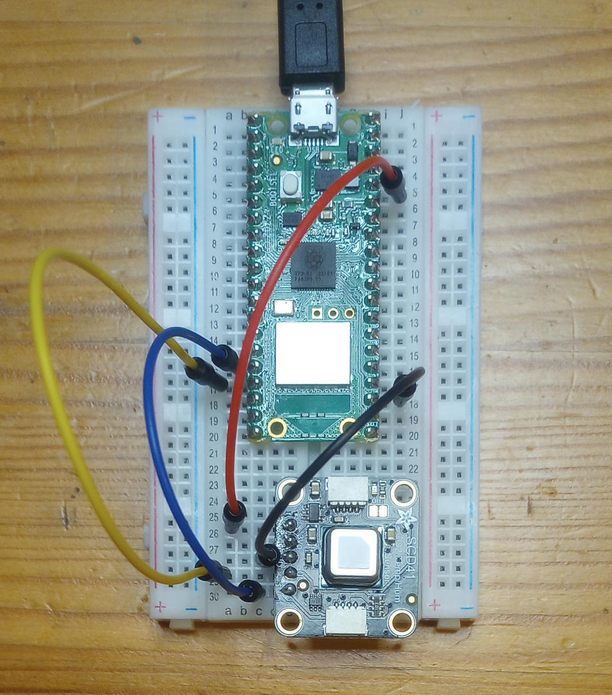

SCD4x on the Raspberry Pi Pico
==============================


In this example, an SCD41 is connected to a Raspberry Pi Pico W on GPIO pins 16
(I2C0 SDA) and 17 (I2C0 SCL). The same code will work for any variant of the
Pico.

The following shell session is from an Ubuntu machine that had the Pico plugged
in to USB in boot select mode.

```console
$ ls
CMakeLists.txt  hardware.jpg  main.c  README.md  sensirion_i2c_hal.c

$ mkdir build

$ cd build

$ cmake -DPICO_SDK_PATH=$HOME/src/pico-sdk ..
[...]

$ make -j
[...]

$ ls
CMakeCache.txt  cmake_install.cmake  generated  main.dis  main.elf.map  main.uf2  pico-sdk
CMakeFiles      elf2uf2              main.bin   main.elf  main.hex      Makefile  pioasm

$ cp main.uf2 /media/$USER/RPI-RP2

$ screen /dev/ttyACM0
The I2C baudrate is 399361 Hz
Sensor serial number is: 0x8a7e 0xbb07 0x3ba0
CO2: 1111 ppm, Temperature: 28.4 C (83.1 F), Humidity: 60.4%
CO2: 1080 ppm, Temperature: 28.5 C (83.2 F), Humidity: 61.1%
CO2: 1070 ppm, Temperature: 28.4 C (83.1 F), Humidity: 61.7%
[...]
```
